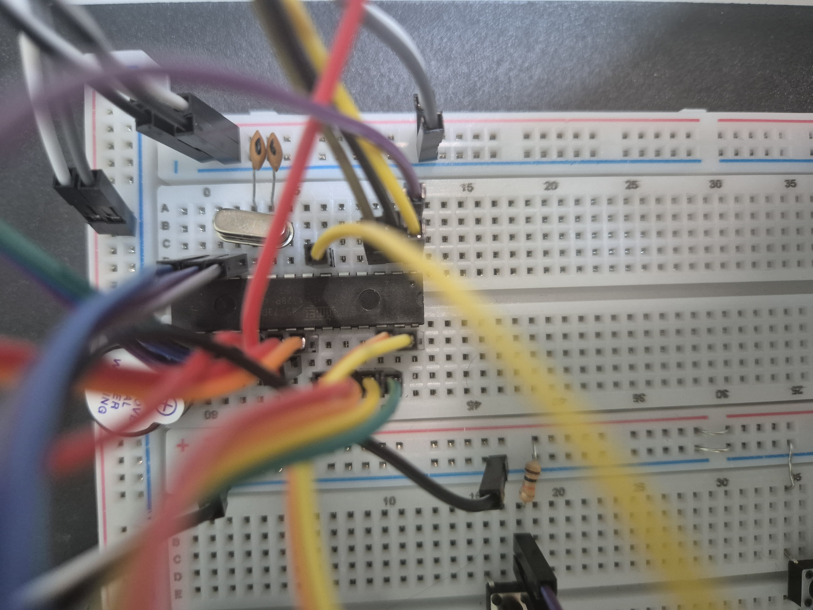
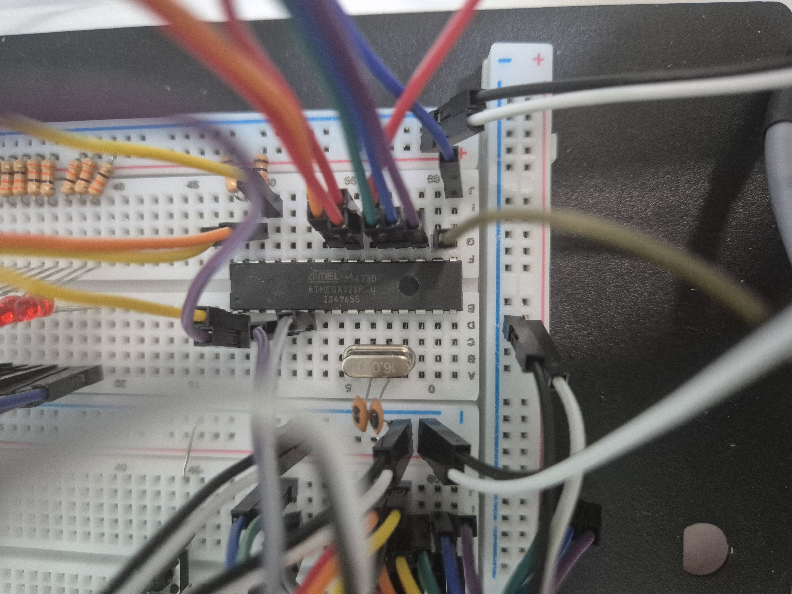
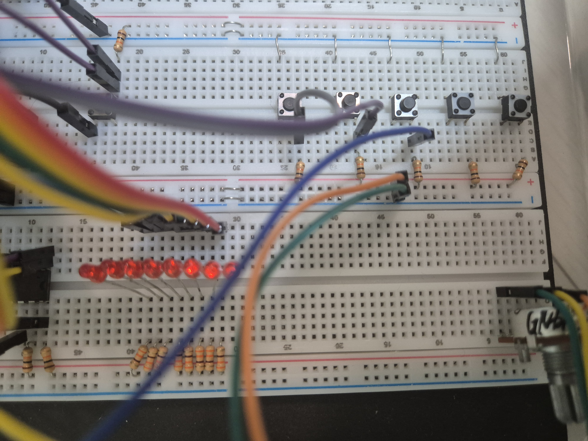

# 전공 : 마이크로컨트롤러 응용 [A+]
**마이크로컨트롤러 응용 과목의 강의 및 실습 내용을 요약한 자료입니다.**
---

# 최종 하드웨어 

---

## 개발 환경
- **Target Board**: AVR ATmega328  
- **Host PC**: ISP 연결 후 실행 파일(hex/bin) 다운로드  
- **SDK**: Microchip Studio (Compiler + Linker)

---

# 중간고사 학습 내용 정리 (주차별)
본 README는 중간고사 범위에 해당하는 실습 코드들을 기반으로, **주차별로 학습한 핵심 개념과 구현 내용**을 정리한 문서입니다.

## Week 1, 2, 3 – 설치 및 개발 환경 세팅
- 회로도 그리기 및 회로도 기반 브레드보드 회로 연결
- Microchip Studio, ISP 드라이버 설치
- LED 출력으로 정상 동작 여부 확인

## Week 4, 5, 6 – GPIO & PORT 제어

- AVR ATmega328 기반 GPIO 포트 입출력 제어 학습
- `DDRx`, `PORTx`, `PINx` 레지스터를 이용한 포트 설정 및 입력 처리
- 비트 마스킹과 시프트 연산을 활용한 LED 제어
- 함수 분리를 통해 다양한 **LED 패턴 구현**  (전체 ON/OFF, Shift, Alternating, Across)
- 스위치 입력에 따른 LED 동작 제어

## Week 7 – 인터럽트 제어
- 외부 인터럽트(INT0, INT1)와 핀체인지 인터럽트(PCINT) 동작 원리 학습
- `EICRA`, `EIMSK`, `EIFR` 레지스터를 이용한 **외부 인터럽트 설정**
- 인터럽트 서비스 루틴(ISR)을 이용한 이벤트 기반 제어
- 버튼 입력에 따라 LED 동작 모드 및 패턴 전환
- 상태 변수(STATUS)를 활용한 동작 흐름 관리

### Week 8 - 중간고사
- GPIO 포트 설정 및 내부 풀업 저항 활용
- 여러 LED 패턴을 상태 변수(`STATUS`)로 관리
  1. 기본 이동 패턴
  2. 양방향(왕복) 이동
  3. 대칭(Dual) 패턴
  4. 누적(Stack) 패턴
  5. 복합(Final) 패턴
- 외부 인터럽트(INT0, INT1)를 이용한 LED 모드 전환
- 핀체인지 인터럽트(PCINT)를 이용한 버튼 입력 처리
- 버튼 입력을 통해 동작 시작/정지 및 속도 조절 기능 구현
- 인터럽트 기반 이벤트 처리와 메인 루프 분리 구조 설계

---
# 기말고사 학습 내용 정리 (주차별)

### Week 9, 10 - UART(USART) 통신 기초
- AVR **UART(USART) 통신 기초** 학습  
- **Polling 방식**과 **Interrupt 방식**의 차이점 이해
- `USART_RX_vect` 수신 인터럽트를 이용한 **버퍼 기반 명령 수신 구조 구현**
- **Baud Rate 설정**
- **UART용 printf 함수 구현** (`va_list`, `vsprintf`)
- **CatTerm**을 사용하여 UART 통신 송수신 확인
- **과제** : STX/ETX 기반 프로토콜과 FSM 설계로 수신 명령을 처리하여 동작 구현

### Week 11 – AVR Timer 모드(Normal/CTC) 학습
- **11week_1_CTC.c** : `TCCR0A, TCCR0B, OCR0A, TIMSK0` 레지스터를 활용하여 **CTC 모드 동작과 분주비 및 인터럽트를 제어**하여 일정 주기의 **타이머 인터럽트 기반 LED 점멸 제어 시스템 구현**
- **11week_1_NORMAL.c** : **Normal 모드와 분주비 설정 및 Overflow 인터럽트를 제어**하여 **일정 시간 간격으로 LED가 점멸하는 시스템 구현**
- **11week_2_Assignment.c** : **CTC 모드와 출력 토글 동작을 제어**하여 버튼 입력에 따른 부저 음계 변경 및 ON/OFF 가능한 **타이머 기반 부저 음계 시스템 구현**

### Week 12 – AVR ADC 모드 학습
- **ADMUX, ADCSRA 레지스터를 활용**하여 ADC 채널 선택과 기준 전압 및 변환 동작 제어
  - 아날로그 센서 값을 디지털로 변환 후 UART로 출력 및 LED 표시
- **과제** : **ADC를 활용해 아날로그 센서 값을 디지털로 변환**하고 UART 시리얼 통신으로 출력하며 변환된 값에 따라 **CTC 모드 기반 PWM 신호로 부저 음계를 생성하여 센서 값 변화에 따라 소리가 달라지는 시스템**

### Week 13 – I2C, SPI 보드간 통신 실습
- **13week_Assignment_I2C** : **UART 입력 데이터를 기반으로 I2C Master 통신을 수행하여 Slave 장치와 데이터를 송수신**하고 통신 결과를 시리얼 출력하여 확인
- **13week_Assignment_SPI** : **SPI Master/Slave 통신을 구성하여 데이터 송수신 기능을 구현**하고 통신 결과를 확인

